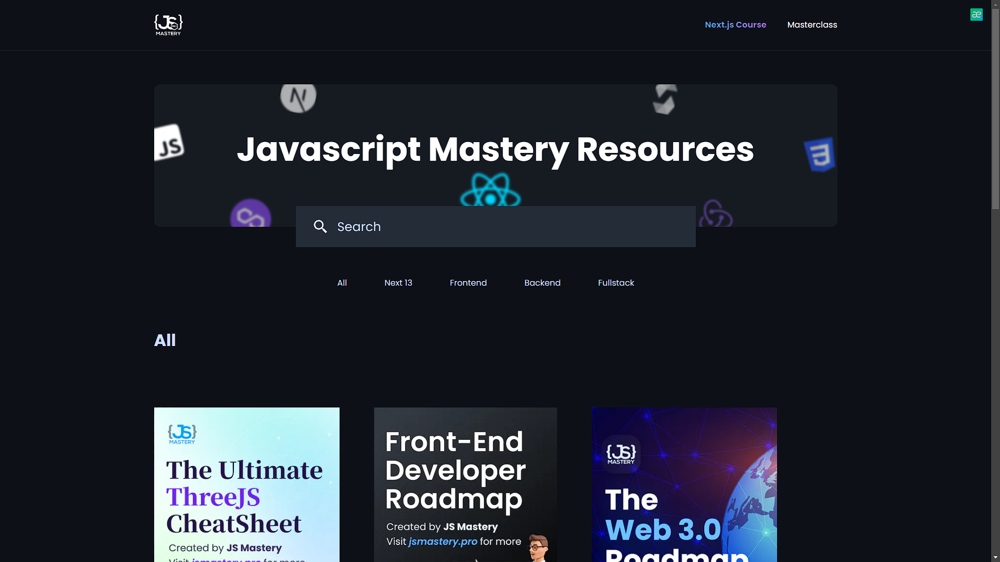

# js_mastery_clone

  

<h4 align="center" >🚀 🟪 JS Mastery 🟪 🚀</h4>

<h4 align="center">
  This application is a conclusion of my study about website perfomance with NextJS using JS Mastery Site as example
</h4>

#

  |&nbsp;&nbsp;
  <a style="color: #8a4af3;" href="#project">Overview</a>&nbsp;&nbsp;&nbsp;|&nbsp;&nbsp;&nbsp;
  <a style="color: #8a4af3;" href="#techs">Technologies</a>&nbsp;&nbsp;&nbsp;|&nbsp;&nbsp;&nbsp;
  <a style="color: #8a4af3;" href="#app">Project</a>&nbsp;&nbsp;&nbsp;|&nbsp;&nbsp;
  <a style="color: #8a4af3;" href="#run-project">Run</a>&nbsp;&nbsp;&nbsp;|&nbsp;&nbsp;
  <a style="color: #8a4af3;" href="#author">Author</a>&nbsp;&nbsp;&nbsp;|&nbsp;&nbsp;&nbsp;

#

<h1 align="center">
  
  

  

  

</h1>

 

 

<h2>  | :artificial_satellite: About:  </h2>

In this project, the objective is to build a website that beats all the main factors and metrics that measure how fast and well-structured an application can be, along with good ranking and SEO strategies. These metrics are known as Web Vitals

With this objective in mind, I recreated the JS_Mastery website using React and the NextJS Framework, with the idea of creating a project closer to the real world, having to deal with dynamic data coming from Sanity CMS;

 

📡 | Hosted on Vercel: [ https://js-mastery-clone.vercel.app/ ]

 

#

 

<h2 id="techs">
  :building_construction: | Technologies and Concepts Studied:
</h2>

> 

- NextJS 14
- TailwindCSS
- Styled Components
- Typescript
- Docker
- Sanity
- SWR
- eslint
- Prettier
- husky
- lint-staged
- Caching
- Perfomance
- SEO
- Scalability
- Web Vitals

> Among Others...

#

 

<h2 id="app">
  💻 | Application:
</h2>

